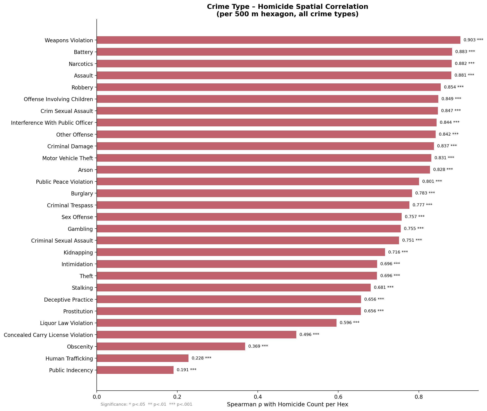
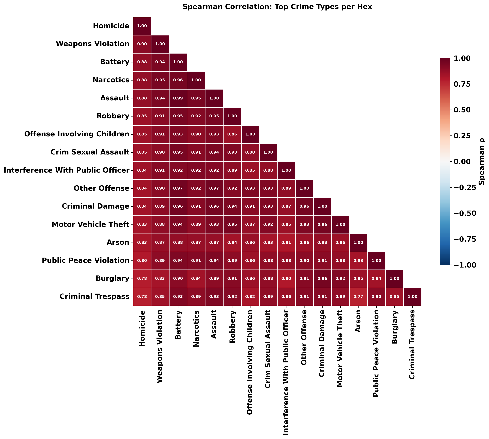
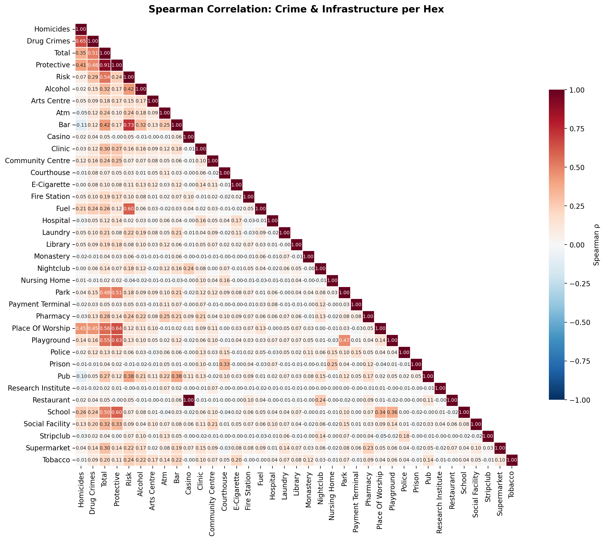

# gun-violence-analysis

## Overview
This goal of this repo is to study general crime in Chicago. We want to find correlational and causal links between types of crimes and other outside information, like social infrastructure and demographic factors. Refer to the Highlights section for the most interesting outputs.

## Work Done So Far
As of now, we have completed some surface-level analysis, and have generated some interactive maps to show crime scene trends in Chicago. Our surface level analysis focuses on homicides, which includes a chart plotting homicides over time and the 10 most frequent location descriptions of where the homicide occurred, among others. We have also completed a correlation analysis between crime types and social infrastructure at the 500m hexagon level. This includes analyzing the spatial co-occurrence of homicide, narcotics offenses, and both protective (e.g., schools, places of worship) and risk-associated (e.g., bars, liquor stores) infrastructure to understand urban crime ecology. In addition, we have generated interactive maps covering homicides, motor vehicle thefts, and drug offenses of any type. These maps cover the city of Chicago in 500-meter flat axial hexagonal grids, counting the number of instances of the focal crime and plotting them over the city. The interactivity comes from being able to change the size of the hexagons, and the map will regenerate itself. This allows for increased granularity (almost down to the street), or just studying larger trends.

## Next Steps
- Research important events related to policing in Chicago with goal of inferring causality (Dylan)
- Try to predict amount of a given crime in a given hexagon using a Bayesian temporal model (???)

Analysis pipeline and project repository for studying Chicago homicide patterns.

This repository is organized so a reviewer can see:

- the question the team is working on,
- the data sources used,
- the scripts that generate the main outputs,
- the figures, maps, and model results produced so far.

## Highlights

If you only open a few things in the repository, start with these:

- [Project slides](https://docs.google.com/presentation/d/1r3yGWe5nyEBj4HpeNcQ_DzlclLKmw4AoyAubE0k-A0w/edit?usp=sharing)
- [Project writeup](report/3_6%20Capstone%20Report.md) (Outdated, refer to top of README for latest update on project)
- [Combined Chicago crime hex map output](reports/maps/crime_hex_maps/chicago_hex_map.html)
- [Homicide rank-order plot](reports/figures/homicide_rank_order_plot.png)
- [Interactive rank-order plot](reports/figures/interactive_rank_order.html)
- [Crime-type vs homicide correlation chart](reports/figures/correlation_crime_vs_homicide.png)
- [Hotspot model metrics](reports/modeling/hotspot/xgboost_metrics.json)
- [Count model metrics](reports/modeling/count/xgboost_metrics.json)

GitHub will preview the Markdown, CSV, JSON, and PNG outputs directly in the browser. The interactive HTML files are included in the repo, but they are easiest to inspect by downloading them or serving the repository locally.

## Project Scope

The project focuses on homicide patterns in Chicago and uses related data sources to add spatial context:

- Chicago homicide incidents
- Chicago drug-crime incidents
- All 30+ crime types from the full Chicago Crimes 2001–Present dataset (8.4M+ incidents)
- social infrastructure locations from OpenStreetMap
- Chicago socioeconomic indicators by community area

The core idea is to aggregate incidents into uniform hexagonal cells instead of working only with raw point locations. That gives the project a common spatial unit for mapping, feature engineering, and prediction.

## What The Repository Contains

### 1. Data Preparation And Hex Aggregation

The repository converts incident-level records into 500 meter hex cells and writes processed tables under `data/processed/hex/`.

Main script:

- [`src/build_hex_maps.py`](src/build_hex_maps.py)

Main outputs:

- [`reports/maps/crime_hex_maps/chicago_hex_map.html`](reports/maps/crime_hex_maps/chicago_hex_map.html)
- [`data/processed/hex/chicago_homicides_hex_counts.csv`](data/processed/hex/chicago_homicides_hex_counts.csv)
- [`data/processed/hex/chicago_drug_hex_counts.csv`](data/processed/hex/chicago_drug_hex_counts.csv)
- additional per-crime incident and time/season tables under [`data/processed/hex/`](data/processed/hex/)

Current behavior:

- If a full Chicago crimes CSV is present in `data/raw/`, the map builder auto-discovers crime types from `Primary Type`.
- Otherwise it falls back to the filtered crime CSVs already stored in `data/raw/`.
- The interactive map supports multiple hex sizes, but the persisted CSV outputs are written for the default `500m` hex size.

### 2. Correlation Analysis — All Crime Types and Social Infrastructure

The correlation analysis reads the full Chicago Crimes CSV (8.4M+ records, 30 crime types), assigns every incident to the same 500 m hex grid, and computes Spearman and Pearson correlations between each crime type and homicide at the hexagon level. Infrastructure from OpenStreetMap is also hex-binned and correlated.

Main script:

- [`src/build_correlation_analysis.py`](src/build_correlation_analysis.py)

Main outputs:

- [`data/processed/crime_infrastructure_hex_merged.csv`](data/processed/crime_infrastructure_hex_merged.csv) — full merged hex table (1,778 hexagons × 30 crime types + infrastructure)
- [`reports/figures/correlation_crime_vs_homicide.png`](reports/figures/correlation_crime_vs_homicide.png) — bar chart of ρ per crime type
- [`reports/figures/correlation_matrix_all_crimes.png`](reports/figures/correlation_matrix_all_crimes.png) — heatmap across crime types
- [`reports/figures/correlation_matrix_crime_infrastructure.png`](reports/figures/correlation_matrix_crime_infrastructure.png) — combined heatmap
- [`reports/figures/correlation_summary.txt`](reports/figures/correlation_summary.txt) — full numerical summary

### 3. Predictive Modeling

The repository trains two XGBoost models on the hex-level table:

- a homicide hotspot classifier
- a homicide count regressor

Main script:

- [`src/train_xgboost_hex_model.py`](src/train_xgboost_hex_model.py)

Feature families include:

- homicide counts as the target
- drug crime volume, timing, and location-description features
- infrastructure counts by type
- socioeconomic indicators mapped from the dominant community area in each hex

Main outputs:

- [`data/processed/modeling/chicago_hex_modeling_table.csv`](data/processed/modeling/chicago_hex_modeling_table.csv)
- [`reports/modeling/hotspot/`](reports/modeling/hotspot/)
- [`reports/modeling/count/`](reports/modeling/count/)

### 4. Exploratory And Reporting Figures

The repository also includes figures that summarize the spatial and distributional behavior of the data.

Primary outputs:

- [`reports/figures/monthly_counts.png`](reports/figures/monthly_counts.png)
- [`reports/figures/top10_location_descriptions.png`](reports/figures/top10_location_descriptions.png)
- [`reports/figures/homicide_rank_order_plot.png`](reports/figures/homicide_rank_order_plot.png)
- [`reports/figures/interactive_rank_order.html`](reports/figures/interactive_rank_order.html)

Current scripted rank-order stage:

- [`src/build_rank_order_plot.py`](src/build_rank_order_plot.py)

### 5. Project Report And Notebooks

Background narrative and earlier exploratory work live here:

- [`report/3_6 Capstone Report.md`](report/3_6%20Capstone%20Report.md)
- [`notebooks/exploration/chicago_analysis.ipynb`](notebooks/exploration/chicago_analysis.ipynb)
- [`notebooks/reporting/chicago_analysis_report.ipynb`](notebooks/reporting/chicago_analysis_report.ipynb)

The notebooks are useful for understanding the project's evolution, but the operational source of truth is the Python code in `src/`.

## Current Results

### Crime Type ↔ Homicide Spatial Correlation (All 29 Types)

Using the full Chicago Crimes dataset (2001–2026, 8.4M incidents), we computed Spearman rank correlations between per-hex counts of every crime type and homicide across 1,778 populated 500 m hexagons.

Every crime type is positively correlated with homicide — crime concentrates in the same places. But the strength varies enormously:

| Crime Type | Spearman ρ | Hexagons Present | Total Incidents |
| :--- | ---: | ---: | ---: |
| Weapons Violation | **0.903** | 1,571 | 126,258 |
| Battery | **0.883** | 1,714 | 1,546,209 |
| Narcotics | **0.882** | 1,646 | 753,820 |
| Assault | **0.881** | 1,692 | 570,663 |
| Robbery | **0.854** | 1,588 | 315,050 |
| Offense Involving Children | **0.849** | 1,514 | 56,701 |
| Crim Sexual Assault | **0.847** | 1,457 | 25,776 |
| Interference With Public Officer | **0.844** | 1,355 | 20,562 |
| Other Offense | **0.842** | 1,678 | 527,711 |
| Criminal Damage | **0.837** | 1,706 | 964,363 |
| Motor Vehicle Theft | **0.831** | 1,666 | 435,248 |
| Arson | **0.828** | 1,378 | 14,470 |
| Public Peace Violation | **0.801** | 1,555 | 54,962 |
| Burglary | **0.783** | 1,620 | 448,615 |
| Criminal Trespass | **0.777** | 1,635 | 228,019 |
| Sex Offense | **0.757** | 1,517 | 32,676 |
| Gambling | **0.755** | 904 | 14,568 |
| Theft | 0.696 | 1,720 | 1,789,530 |
| Deceptive Practice | 0.656 | 1,646 | 372,679 |
| Prostitution | 0.656 | 1,038 | 69,806 |
| Concealed Carry License Violation | 0.496 | 583 | 1,734 |
| Human Trafficking | 0.228 | 115 | 126 |
| Public Indecency | 0.191 | 172 | 228 |

All correlations significant at p < 0.001.

**Key finding:** Weapons violations (ρ = 0.903) surpasses narcotics (ρ = 0.882) as the strongest spatial correlate of homicide. This makes mechanistic sense — weapons are the proximate instrument of lethal violence. The top cluster (weapons, battery, narcotics, assault, robbery) all exceed ρ = 0.85, forming a tightly co-located syndrome of violent crime. Property and white-collar offenses (theft at 0.70, deceptive practice at 0.66) still correlate positively but much more weakly, consistent with those crimes having different geographic distributions.

### Infrastructure ↔ Homicide Correlation

| Infrastructure Category | Spearman ρ with Homicide | p-value |
| :--- | ---: | ---: |
| Protective (aggregate) | +0.398 | 1.0 × 10⁻⁴⁸ |
| Risk-associated (aggregate) | +0.058 | 0.040 |
| Place of Worship | +0.454 | < 0.001 |
| School | +0.247 | < 0.001 |
| Fuel Station | +0.217 | < 0.001 |
| Bar | −0.142 | < 0.001 |
| Community Centre | +0.140 | < 0.001 |
| Playground | +0.123 | < 0.001 |
| Social Facility | +0.117 | < 0.001 |
| Pub | −0.079 | < 0.01 |

The positive correlation between protective infrastructure and homicide is an ecological artifact: cities build schools, churches, and social facilities in dense residential neighborhoods — the same disadvantaged neighborhoods that experience the most violence. This does **not** imply these institutions cause violence; rather, they are co-located with the populations most affected by it. The negative bar/pub correlation reflects that nightlife clusters in wealthier commercial districts (e.g., Lincoln Park, River North) with lower homicide rates.

### Full Spearman Matrix (Homicide + Top-5 Crime Types + Infrastructure Aggregates)

|  | Homicide | Weapons | Battery | Narcotics | Assault | Robbery | Infra Total | Protective | Risk |
|--|----------|---------|---------|-----------|---------|---------|-------------|------------|------|
| **Homicide** | 1.000 | 0.903 | 0.883 | 0.882 | 0.881 | 0.854 | 0.554 | 0.569 | 0.244 |
| **Weapons** | 0.903 | 1.000 | 0.944 | 0.951 | 0.945 | 0.905 | 0.616 | 0.629 | 0.272 |
| **Battery** | 0.883 | 0.944 | 1.000 | 0.958 | 0.991 | 0.947 | 0.720 | 0.709 | 0.369 |
| **Narcotics** | 0.882 | 0.951 | 0.958 | 1.000 | 0.953 | 0.919 | 0.663 | 0.659 | 0.333 |
| **Assault** | 0.881 | 0.945 | 0.991 | 0.953 | 1.000 | 0.947 | 0.722 | 0.709 | 0.370 |
| **Robbery** | 0.854 | 0.905 | 0.947 | 0.919 | 0.947 | 1.000 | 0.731 | 0.696 | 0.432 |

The latest generated model outputs in this repository were produced on 500 meter hex cells with 1,525 populated hex observations and 64 model features.

| Task | Metric | Current value |
| :--- | :--- | ---: |
| Hotspot classification | ROC AUC | 0.957 |
| Hotspot classification | Average precision | 0.838 |
| Hotspot classification | Accuracy | 0.906 |
| Hotspot classification | F1 | 0.775 |
| Count regression | RMSE | 5.780 |
| Count regression | MAE | 3.491 |
| Count regression | R² | 0.767 |

Metric sources:

- [`reports/modeling/hotspot/xgboost_metrics.json`](reports/modeling/hotspot/xgboost_metrics.json)
- [`reports/modeling/count/xgboost_metrics.json`](reports/modeling/count/xgboost_metrics.json)

## Example Outputs

### Crime-Type vs Homicide Correlation (All Types)



### Crime Type Correlation Heatmap



### Crime & Infrastructure Combined Heatmap



### Homicide Rank-Order Plot


### Monthly Homicide Counts


### Top Homicide Location Descriptions


## Repository Guide

- [`src/`](src/): scripts that generate the current pipeline outputs
- [`data/raw/`](data/raw/): source CSV inputs used by the pipeline
- [`data/processed/hex/`](data/processed/hex/): generated hex-level outputs for mapping and downstream analysis
- [`data/processed/modeling/`](data/processed/modeling/): generated modeling table
- [`reports/maps/`](reports/maps/): generated map artifacts
- [`reports/figures/`](reports/figures/): generated figures
- [`reports/modeling/`](reports/modeling/): generated modeling reports and feature-importance outputs
- [`report/`](report/): written project report and background context
- [`notebooks/`](notebooks/): exploratory notebook work

## Data Sources

Primary upstream data source:

- Chicago Crimes, 2001 to Present: https://data.cityofchicago.org/Public-Safety/Crimes-2001-to-Present/ijzp-q8t2/about_data

Additional supporting data sources used in the repository:

- OpenStreetMap-derived infrastructure locations via `osmnx`
- Chicago socioeconomic indicators by neighborhood/community area

Expected raw inputs under `data/raw/`:

- `Crimes_-_2001_to_Present_20260408.csv` (full dataset, used by correlation analysis)
- `chicago_violence_homicides.csv`
- `chicago_drug_crimes.csv`
- `infrastructure_locations.csv`
- `chicago_socioeconomic_neighborhoods.csv`

## Reproducing The Pipeline

Install dependencies:

```bash
python3 -m pip install -r requirements.txt
```

Run the main stages from the repository root:

```bash
python3 src/build_infrastructure_data.py        # optional, refreshes OSM-derived infrastructure data
python3 src/build_hex_maps.py                   # builds the combined hex map and hex-level CSV outputs
python3 src/build_correlation_analysis.py       # all-crime-type + infrastructure hex correlation analysis
python3 src/train_xgboost_hex_model.py          # trains hotspot and count models
python3 src/build_rank_order_plot.py            # builds the static and interactive rank-order plots
```

## References

- City of Chicago. *Crimes — 2001 to Present.* Chicago Data Portal. https://data.cityofchicago.org/Public-Safety/Crimes-2001-to-Present/ijzp-q8t2/about_data
- Boeing, G. (2017). OSMnx: New methods for acquiring, constructing, analyzing, and visualizing complex street networks. *Computers, Environment and Urban Systems*, 65, 126–139.
- Sampson, R. J. (2012). *Great American City: Chicago and the Enduring Neighborhood Effect.* University of Chicago Press.

## Notes

- Prefer the scripts in `src/` over notebooks or older prose when they disagree.
- Generated artifacts under `data/processed/` and `reports/` should be regenerated from scripts rather than edited by hand.
- Some older exploratory outputs remain in the repository for comparison, but the combined hex map in `reports/maps/crime_hex_maps/` and the model outputs in `reports/modeling/` are the clearest view of the team's current progress.
