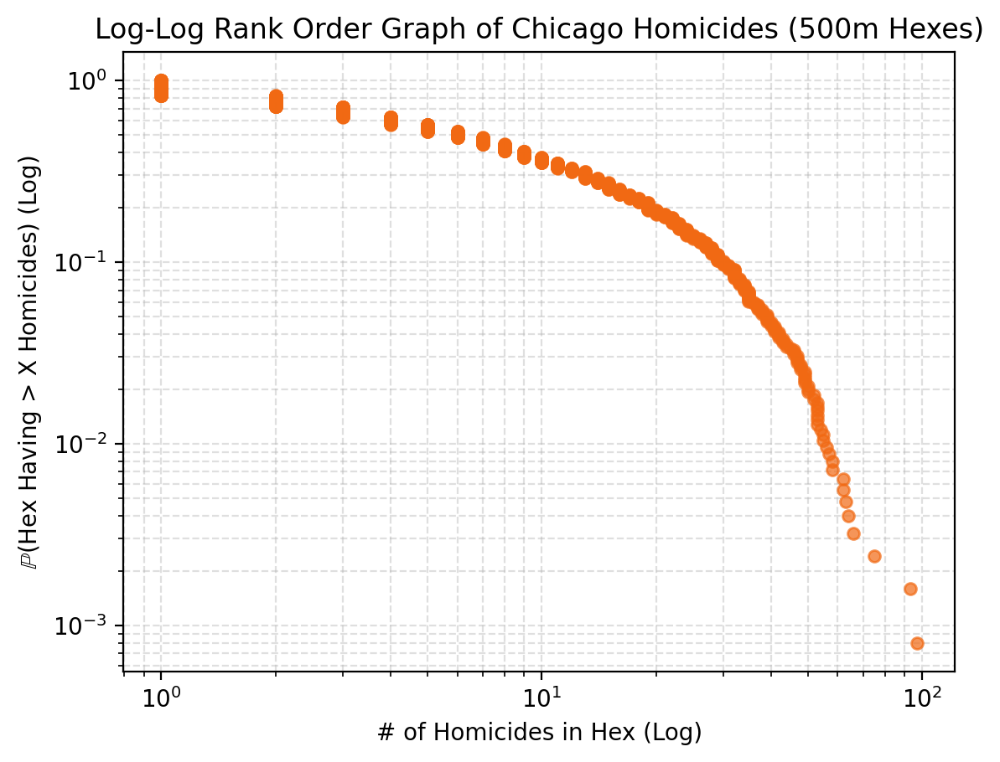
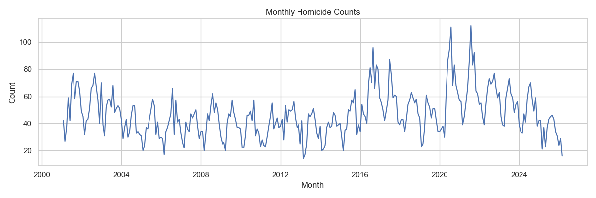
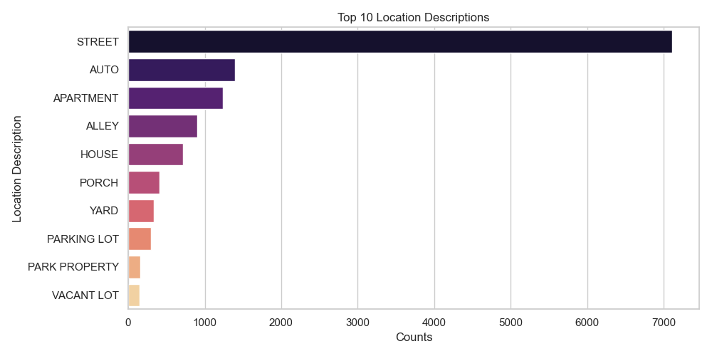

# gun-violence-analysis

Analysis pipeline and project repository for studying Chicago homicide patterns.

This repository is organized so a reviewer can see:

- the question the team is working on,
- the data sources used,
- the scripts that generate the main outputs,
- the figures, maps, and model results produced so far.

## Start Here

If you only open a few things in the repository, start with these:

- [Project writeup](report/3_6%20Capstone%20Report.md)
- [Combined Chicago crime hex map output](reports/maps/crime_hex_maps/chicago_hex_map.html)
- [Homicide rank-order plot](reports/figures/homicide_rank_order_plot.png)
- [Interactive rank-order plot](reports/figures/interactive_rank_order.html)
- [Hotspot model metrics](reports/modeling/hotspot/xgboost_metrics.json)
- [Count model metrics](reports/modeling/count/xgboost_metrics.json)

GitHub will preview the Markdown, CSV, JSON, and PNG outputs directly in the browser. The interactive HTML files are included in the repo, but they are easiest to inspect by downloading them or serving the repository locally.

## Project Scope

The project focuses on homicide patterns in Chicago and uses related data sources to add spatial context:

- Chicago homicide incidents
- Chicago drug-crime incidents
- social infrastructure locations from OpenStreetMap
- Chicago socioeconomic indicators by community area

The core idea is to aggregate incidents into uniform hexagonal cells instead of working only with raw point locations. That gives the project a common spatial unit for mapping, feature engineering, and prediction.

## What The Repository Contains

### 1. Data Preparation And Hex Aggregation

The repository converts incident-level records into 500 meter hex cells and writes processed tables under `data/processed/hex/`.

Main script:

- [`src/build_hex_maps.py`](src/build_hex_maps.py)

Main outputs:

- [`reports/maps/crime_hex_maps/chicago_hex_map.html`](reports/maps/crime_hex_maps/chicago_hex_map.html)
- [`data/processed/hex/chicago_homicides_hex_counts.csv`](data/processed/hex/chicago_homicides_hex_counts.csv)
- [`data/processed/hex/chicago_drug_hex_counts.csv`](data/processed/hex/chicago_drug_hex_counts.csv)
- additional per-crime incident and time/season tables under [`data/processed/hex/`](data/processed/hex/)

Current behavior:

- If a full Chicago crimes CSV is present in `data/raw/`, the map builder auto-discovers crime types from `Primary Type`.
- Otherwise it falls back to the filtered crime CSVs already stored in `data/raw/`.
- The interactive map supports multiple hex sizes, but the persisted CSV outputs are written for the default `500m` hex size.

### 2. Predictive Modeling

The repository trains two XGBoost models on the hex-level table:

- a homicide hotspot classifier
- a homicide count regressor

Main script:

- [`src/train_xgboost_hex_model.py`](src/train_xgboost_hex_model.py)

Feature families include:

- homicide counts as the target
- drug crime volume, timing, and location-description features
- infrastructure counts by type
- socioeconomic indicators mapped from the dominant community area in each hex

Main outputs:

- [`data/processed/modeling/chicago_hex_modeling_table.csv`](data/processed/modeling/chicago_hex_modeling_table.csv)
- [`reports/modeling/hotspot/`](reports/modeling/hotspot/)
- [`reports/modeling/count/`](reports/modeling/count/)

### 3. Exploratory And Reporting Figures

The repository also includes figures that summarize the spatial and distributional behavior of the data.

Primary outputs:

- [`reports/figures/monthly_counts.png`](reports/figures/monthly_counts.png)
- [`reports/figures/top10_location_descriptions.png`](reports/figures/top10_location_descriptions.png)
- [`reports/figures/homicide_rank_order_plot.png`](reports/figures/homicide_rank_order_plot.png)
- [`reports/figures/interactive_rank_order.html`](reports/figures/interactive_rank_order.html)

Current scripted rank-order stage:

- [`src/build_rank_order_plot.py`](src/build_rank_order_plot.py)

### 4. Project Report And Notebooks

Background narrative and earlier exploratory work live here:

- [`report/3_6 Capstone Report.md`](report/3_6%20Capstone%20Report.md)
- [`notebooks/exploration/chicago_analysis.ipynb`](notebooks/exploration/chicago_analysis.ipynb)
- [`notebooks/reporting/chicago_analysis_report.ipynb`](notebooks/reporting/chicago_analysis_report.ipynb)

The notebooks are useful for understanding the project’s evolution, but the operational source of truth is the Python code in `src/`.

## Current Results

The latest generated model outputs in this repository were produced on 500 meter hex cells with 1,525 populated hex observations and 64 model features.

| Task | Metric | Current value |
| :--- | :--- | ---: |
| Hotspot classification | ROC AUC | 0.957 |
| Hotspot classification | Average precision | 0.838 |
| Hotspot classification | Accuracy | 0.906 |
| Hotspot classification | F1 | 0.775 |
| Count regression | RMSE | 5.780 |
| Count regression | MAE | 3.491 |
| Count regression | R² | 0.767 |

Metric sources:

- [`reports/modeling/hotspot/xgboost_metrics.json`](reports/modeling/hotspot/xgboost_metrics.json)
- [`reports/modeling/count/xgboost_metrics.json`](reports/modeling/count/xgboost_metrics.json)

## Example Outputs

### Homicide Rank-Order Plot



### Monthly Homicide Counts



### Top Homicide Location Descriptions



## Repository Guide

- [`src/`](src/): scripts that generate the current pipeline outputs
- [`data/raw/`](data/raw/): source CSV inputs used by the pipeline
- [`data/processed/hex/`](data/processed/hex/): generated hex-level outputs for mapping and downstream analysis
- [`data/processed/modeling/`](data/processed/modeling/): generated modeling table
- [`reports/maps/`](reports/maps/): generated map artifacts
- [`reports/figures/`](reports/figures/): generated figures
- [`reports/modeling/`](reports/modeling/): generated modeling reports and feature-importance outputs
- [`report/`](report/): written project report and background context
- [`notebooks/`](notebooks/): exploratory notebook work

## Data Sources

Primary upstream data source:

- Chicago Crimes, 2001 to Present: https://data.cityofchicago.org/Public-Safety/Crimes-2001-to-Present/ijzp-q8t2/about_data

Additional supporting data sources used in the repository:

- OpenStreetMap-derived infrastructure locations via `osmnx`
- Chicago socioeconomic indicators by neighborhood/community area

Expected raw inputs under `data/raw/`:

- `chicago_violence_homicides.csv`
- `chicago_drug_crimes.csv`
- `infrastructure_locations.csv`
- `chicago_socioeconomic_neighborhoods.csv`

Optional full-dataset inputs for multi-crime map generation:

- `chicago_crimes_2001_to_present.csv`
- `Crimes_-_2001_to_Present.csv`
- `chicago_crimes.csv`

## Reproducing The Pipeline

Install dependencies:

```bash
python3 -m pip install -r requirements.txt
```

Run the main stages from the repository root:

```bash
python3 src/build_infrastructure_data.py        # optional, refreshes OSM-derived infrastructure data
python3 src/build_hex_maps.py                   # builds the combined hex map and hex-level CSV outputs
python3 src/train_xgboost_hex_model.py          # trains hotspot and count models
python3 src/build_rank_order_plot.py            # builds the static and interactive rank-order plots
```

## Notes

- Prefer the scripts in `src/` over notebooks or older prose when they disagree.
- Generated artifacts under `data/processed/` and `reports/` should be regenerated from scripts rather than edited by hand.
- Some older exploratory outputs remain in the repository for comparison, but the combined hex map in `reports/maps/crime_hex_maps/` and the model outputs in `reports/modeling/` are the clearest view of the team’s current progress.
