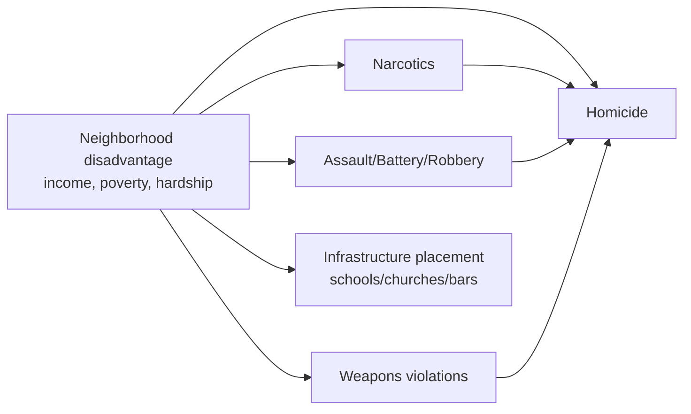
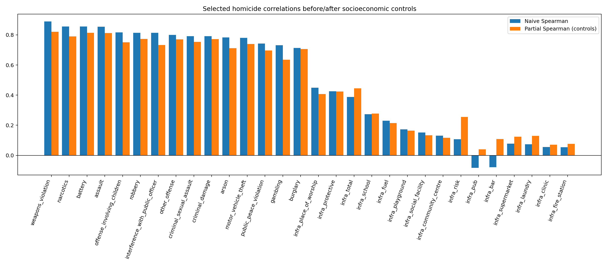

# Addendum: Demographic Controls and DAG-Based Interpretation of Hex-Level Correlations

---

**Authors:** Gun Violence Analysis Project Team  
**Date:** April 2026  
**Related report:** `reports/Correlation_Analysis_Report.md`

---

## Table of Contents

1. [Introduction](#1-introduction)
2. [Data Sources](#2-data-sources)
3. [Methodology](#3-methodology)
4. [Results](#4-results)
5. [Discussion](#5-discussion)
6. [Limitations](#6-limitations)
7. [Conclusion](#7-conclusion)
8. [Reproducibility](#8-reproducibility)

---

## 1. Introduction

The base correlation report establishes strong spatial co-occurrence between homicide, other crime types, and selected infrastructure categories at the 500-meter hex level. This addendum extends that analysis by addressing a core inferential issue: ecological correlations may be confounded by neighborhood socioeconomic context.

In particular, positive homicide correlations for variables such as schools or places of worship can reflect shared geography with disadvantaged residential areas, rather than direct causal effects of those institutions. To formalize this concern, we use a directed acyclic graph (DAG) framing in which socioeconomic disadvantage acts as a common-cause block for multiple observed outcomes.

---

## 2. Data Sources

This addendum uses existing project artifacts and does not introduce new upstream raw data.

### 2.1 Hex-level Crime and Infrastructure Table

- `data/processed/crime_infrastructure_hex_merged.csv`

This table contains per-hex counts of crime types and infrastructure features generated by the correlation-analysis stage.

### 2.2 Hex-level Socioeconomic Fields

- `data/processed/modeling/chicago_hex_modeling_table.csv`

This table provides the socioeconomic fields used in this addendum:

- `per_capita_income`
- `poverty_pct`
- `hardship_index`
- `community_area_number`

### 2.3 Join and Sample Size

The two processed tables are merged on `hex_id`.

- merged hex rows: 1,778  
- rows with socioeconomic fields after join: 1,524  
- complete-case rows used for adjusted analysis: 1,524

---

## 3. Methodology

### 3.1 Conceptual DAG

We adopt the following conceptual DAG for interpretation:

This DAG encodes the idea that observed pairwise associations with homicide may be partly attributable to shared dependence on neighborhood conditions.

### 3.2 Estimands

For each variable \(X\), we estimate:

1. **Naive association:** Spearman $\rho(X, \text{homicide})$
2. **Conditioned association:** Partial Spearman $\rho(X, homicide \mid per\_capita\_income, poverty\_pct, hardship\_index)$

Partial Spearman is computed using the inverse of the Spearman correlation matrix (precision-matrix approach).

### 3.3 Scope

This is an adjustment-based extension of descriptive spatial correlation analysis. It improves interpretation relative to unadjusted pairwise correlations, but does not by itself identify causal effects.

### 3.4 Label Harmonization

To avoid splitting counts across historical aliases, crime labels are harmonized before estimation. In this revision, `crim_sexual_assault` is merged into `criminal_sexual_assault`, and the alias column is removed prior to computing naive and partial correlations.

---

## 4. Results

### 4.1 Full Crime-Type Results (All Crime Variables in the Main Correlation Report)

The following table reports naive and demographically adjusted associations for every crime variable in the report-level merged table (excluding `homicide` and `total_crime`).

| Crime Variable | Naive Spearman | Partial Spearman (controls) | Delta |
|---|---:|---:|---:|
| Weapons Violation | 0.889 | 0.821 | -0.069 |
| Narcotics | 0.857 | 0.790 | -0.067 |
| Battery | 0.856 | 0.814 | -0.042 |
| Assault | 0.854 | 0.812 | -0.042 |
| Offense Involving Children | 0.817 | 0.752 | -0.065 |
| Robbery | 0.814 | 0.774 | -0.040 |
| Interference With Public Officer | 0.813 | 0.733 | -0.080 |
| Criminal Sexual Assault | 0.792 | 0.754 | -0.038 |
| Other Offense | 0.800 | 0.771 | -0.030 |
| Criminal Damage | 0.791 | 0.773 | -0.019 |
| Arson | 0.783 | 0.712 | -0.072 |
| Motor Vehicle Theft | 0.780 | 0.740 | -0.040 |
| Public Peace Violation | 0.743 | 0.697 | -0.047 |
| Gambling | 0.731 | 0.636 | -0.095 |
| Burglary | 0.714 | 0.706 | -0.008 |
| Criminal Trespass | 0.701 | 0.703 | +0.002 |
| Sex Offense | 0.679 | 0.672 | -0.007 |
| Kidnapping | 0.642 | 0.599 | -0.043 |
| Intimidation | 0.612 | 0.590 | -0.022 |
| Stalking | 0.592 | 0.577 | -0.014 |
| Prostitution | 0.591 | 0.533 | -0.058 |
| Theft | 0.581 | 0.627 | +0.046 |
| Deceptive Practice | 0.533 | 0.625 | +0.092 |
| Liquor Law Violation | 0.476 | 0.524 | +0.048 |
| Concealed Carry License Violation | 0.451 | 0.348 | -0.103 |
| Obscenity | 0.286 | 0.319 | +0.033 |
| Human Trafficking | 0.205 | 0.131 | -0.074 |
| Public Indecency | 0.151 | 0.170 | +0.019 |

### 4.2 Full Infrastructure Results (All Infrastructure Variables in the Main Correlation Report)

The following table reports naive and adjusted associations for all infrastructure features and aggregates (`infra_*`) in the merged table.

| Infrastructure Variable | Naive Spearman | Partial Spearman (controls) | Delta |
|---|---:|---:|---:|
| Place of Worship | 0.449 | 0.408 | -0.041 |
| Protective (Aggregate) | 0.425 | 0.424 | -0.001 |
| Total Infrastructure | 0.388 | 0.445 | +0.057 |
| School | 0.273 | 0.277 | +0.005 |
| Fuel | 0.230 | 0.215 | -0.016 |
| Playground | 0.172 | 0.165 | -0.007 |
| Social Facility | 0.152 | 0.134 | -0.018 |
| Community Centre | 0.130 | 0.116 | -0.014 |
| Risk (Aggregate) | 0.108 | 0.255 | +0.147 |
| Supermarket | 0.078 | 0.124 | +0.046 |
| Laundry | 0.074 | 0.129 | +0.056 |
| Clinic | 0.055 | 0.070 | +0.015 |
| Fire Station | 0.054 | 0.076 | +0.022 |
| Library | 0.052 | 0.067 | +0.015 |
| Alcohol | 0.048 | 0.120 | +0.072 |
| Park | 0.042 | 0.082 | +0.039 |
| Arts Centre | 0.041 | 0.062 | +0.021 |
| Casino | 0.022 | 0.051 | +0.029 |
| Restaurant | 0.022 | 0.051 | +0.029 |
| Police | 0.017 | 0.008 | -0.009 |
| Nursing Home | 0.016 | -0.018 | -0.034 |
| E-Cigarette | 0.012 | 0.059 | +0.047 |
| Tobacco | 0.011 | 0.073 | +0.062 |
| Nightclub | 0.005 | 0.047 | +0.042 |
| Courthouse | 0.002 | -0.005 | -0.006 |
| Research Institute | -0.001 | -0.017 | -0.016 |
| Prison | -0.004 | -0.023 | -0.020 |
| Hospital | -0.004 | 0.001 | +0.006 |
| Pharmacy | -0.005 | 0.079 | +0.085 |
| Monastery | -0.013 | -0.012 | +0.001 |
| Payment Terminal | -0.026 | 0.014 | +0.040 |
| Strip Club | -0.034 | -0.015 | +0.019 |
| ATM | -0.038 | 0.036 | +0.073 |
| Bar | -0.079 | 0.108 | +0.188 |
| Pub | -0.082 | 0.039 | +0.122 |

### 4.3 Socioeconomic Variables and Homicide

- `per_capita_income` vs homicide: -0.524  
- `poverty_pct` vs homicide: +0.566  
- `hardship_index` vs homicide: +0.482

These values support the role of socioeconomic structure as a major contextual correlate of homicide concentration.

### 4.4 Visual Comparison: Selected Naive vs Adjusted Correlations

*Figure A1. Selected crime and infrastructure variables comparing naive Spearman associations with demographically adjusted partial Spearman associations. Adjusted estimates condition on per-capita income, poverty percentage, and hardship index.*

---

## 5. Discussion

### 5.1 Violent-Crime Cluster Remains Strong After Controls

Weapons violations, battery, assault, narcotics, and robbery remain the dominant homicide correlates after conditioning on income, poverty, and hardship. Several other interpersonal or enforcement-linked categories (e.g., offense involving children, interference with public officer, sexual-assault categories) also retain moderate-to-strong adjusted associations.

### 5.2 Infrastructure Effects Are Sensitive to Adjustment

Infrastructure variables show heterogeneous adjustment behavior. Some variables change only marginally (e.g., `infra_protective`, `infra_school`), whereas others shift substantially in magnitude and sign (e.g., `infra_bar`, `infra_pub`, `infra_risk`, `infra_pharmacy`, `infra_atm`). This pattern is consistent with confounding by neighborhood composition and land-use sorting across the city.

### 5.3 Interpretation of “Protective” Infrastructure

The positive naive association between some protective categories and homicide should be interpreted as spatial co-location, not as evidence that protective institutions increase lethal violence. In the DAG framing, these institutions are partly colocated with neighborhoods where structural disadvantage and crime burden are both elevated.

---

## 6. Limitations

1. **No causal identification design.** Partial correlation is adjustment-based and remains observational.  
2. **Potential residual confounding.** Only three socioeconomic controls are included in this addendum.  
3. **Cross-sectional aggregation.** Temporal dynamics are not modeled in these estimates.  
4. **Spatial dependence.** Neighboring hexes are not independent, and this framework does not yet include explicit spatial-regression structure.

---

## 7. Conclusion

Adding demographic controls materially improves interpretation of the hex-level homicide correlations. The main violent-crime correlates remain strong after adjustment, while several infrastructure relationships become more clearly understood as confounded ecological overlap rather than direct pathways.

Accordingly, this addendum recommends that project reporting distinguish between:

- **spatial co-occurrence** (naive correlations), and
- **associations conditional on observed socioeconomic context** (partial correlations).

This distinction better aligns the empirical results with defensible causal language.

---

## 8. Reproducibility

- Notebook: `notebooks/exploration/hex_dag_demographics_analysis.ipynb`  
- Base report: `reports/Correlation_Analysis_Report.md`  
- Full output tables (generated from the notebook logic):  
  - `reports/figures/dag_partial_spearman_crime_vs_homicide.csv`  
  - `reports/figures/dag_partial_spearman_infra_vs_homicide.csv`
- Suggested next upgrades:
  1. Complete hex-to-community mapping for all hexes from the full crimes file.
  2. Count-model estimation with controls (e.g., negative binomial / Poisson with robust errors).
  3. Spatial lag/error modeling to address dependence across adjacent hexes.
  4. Panel/event-study extensions if temporal data are brought into a causal design.

