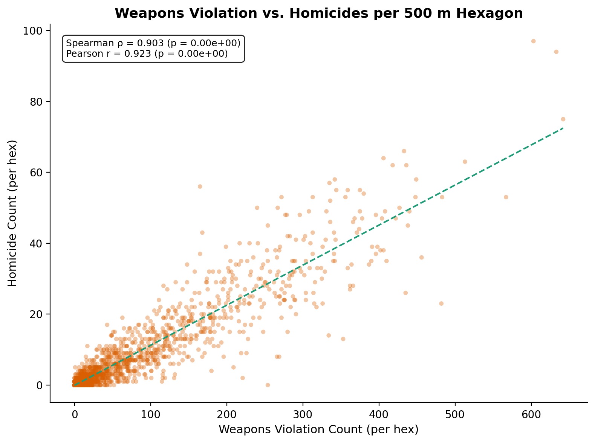
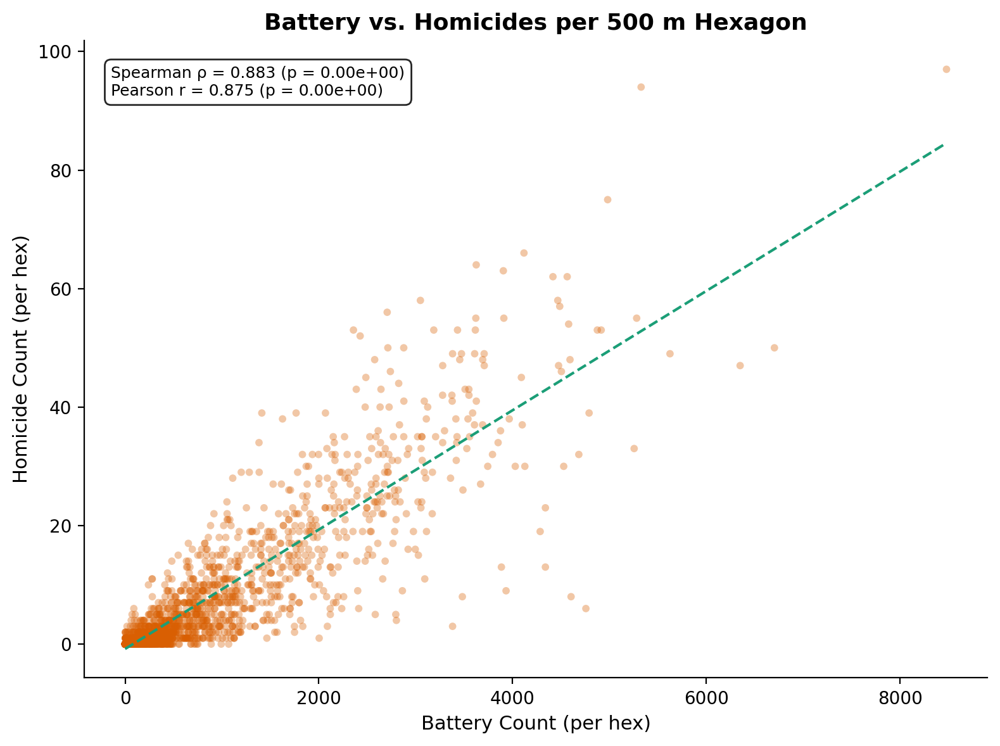
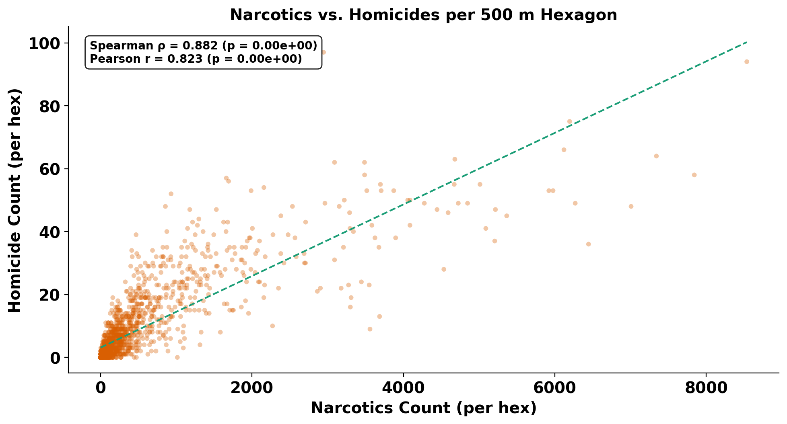
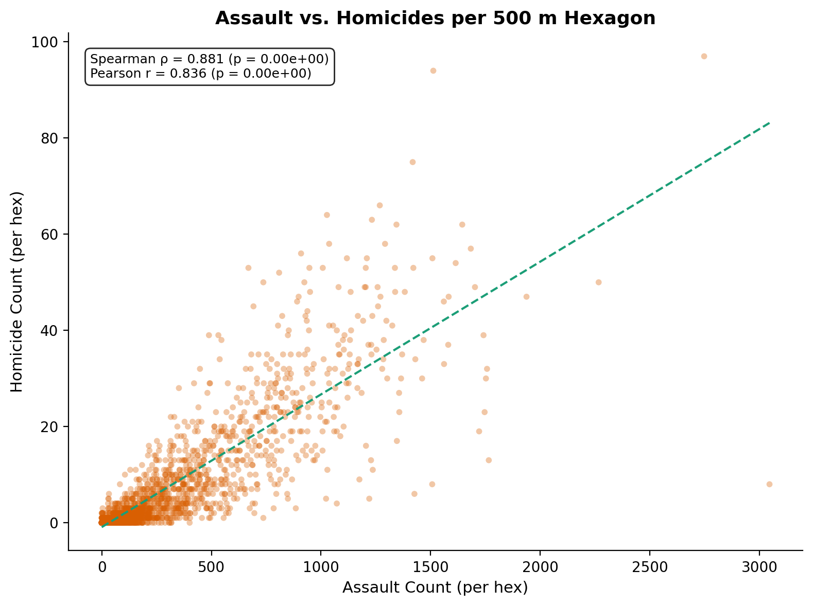
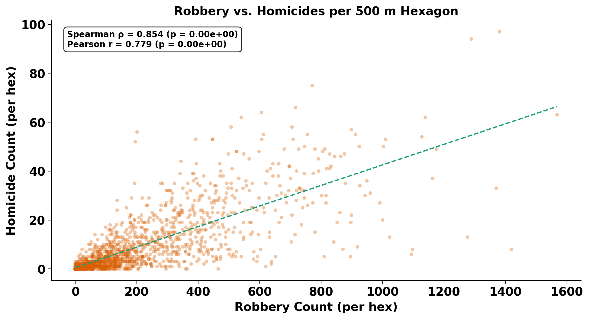
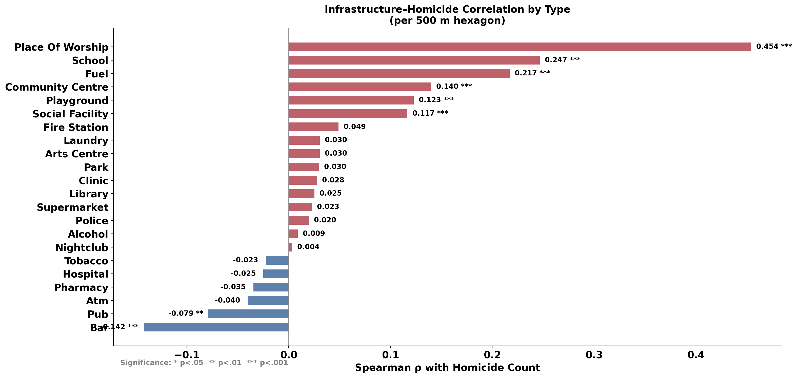
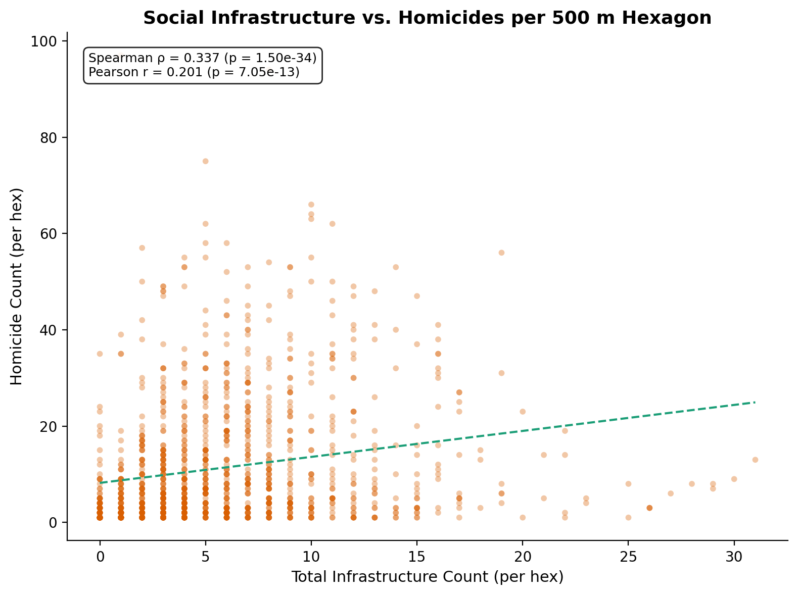
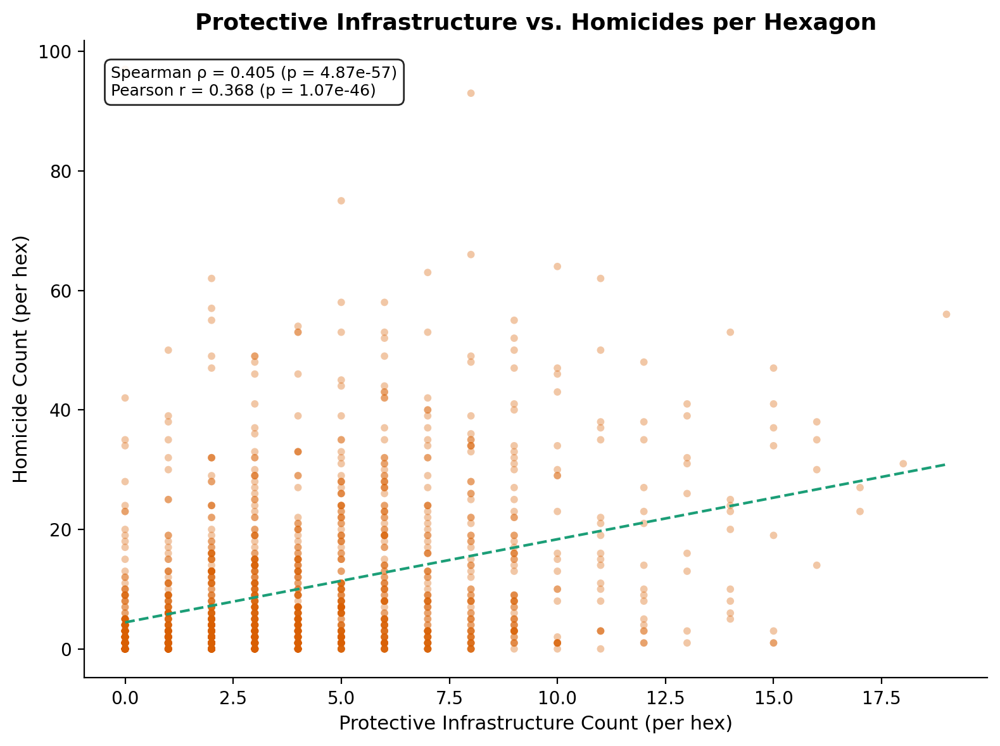
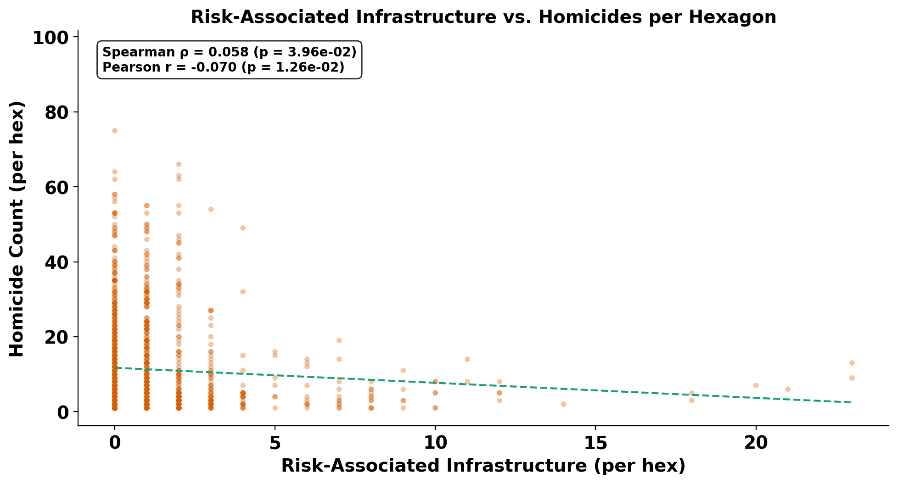

# Spatial Correlates of Homicide in Chicago: A Hexagonal Analysis of Crime Ecology and Social Infrastructure

---

**Authors:** Gun Violence Analysis Project Team

**Date:** April 2026

**Dataset:** City of Chicago Crimes — 2001 to Present (8,430,325 geocoded incidents)

---

## Table of Contents

1. [Introduction](#1-introduction)
2. [Data Sources](#2-data-sources)
3. [Methodology](#3-methodology)
4. [Defining Risk and Protective Infrastructure](#4-defining-risk-and-protective-infrastructure)
5. [Results: Crime Type and Homicide Co-occurrence](#5-results-crime-type-and-homicide-co-occurrence)
6. [Results: Social Infrastructure and Homicide](#6-results-social-infrastructure-and-homicide)
7. [Combined Analysis: Crime, Infrastructure, and Homicide](#7-combined-analysis-crime-infrastructure-and-homicide)
8. [Discussion](#8-discussion)
9. [Limitations](#9-limitations)
10. [Conclusion](#10-conclusion)
11. [References](#11-references)

---

## 1. Introduction

Understanding where homicides occur and what other conditions characterize those places is a foundational question in urban criminology. The spatial concentration of violence is well-documented: a small number of micro-geographic units account for a disproportionate share of lethal crime (Weisburd, 2015). Less understood is the precise relationship between homicide and the broader ecology of crime and infrastructure at those locations.

This report presents a spatial correlation analysis of homicide incidence against two classes of covariates:

1. **Other crime types** — Do hexagons with high homicide counts also exhibit elevated rates of narcotics, weapons violations, battery, robbery, and other offense categories?
2. **Social infrastructure** — Does the presence of schools, parks, places of worship, bars, liquor stores, or other facilities predict higher or lower homicide counts within a spatial unit?

Our motivation is straightforward: if a given area has high drug dealing rates, for example, it may also have high homicide rates due to drug-market violence. Similarly, areas lacking community resources or saturated with alcohol outlets might experience different violence profiles than areas with strong institutional presence.

We operationalize "area" as a **500-meter flat axial hexagonal grid** covering Chicago. Hexagons offer uniform area and neighbor relationships, avoiding the modifiable areal unit problem that distorts results when using administrative boundaries of irregular shape and size (Openshaw, 1984).

---

## 2. Data Sources

### 2.1 Crime Data

The primary dataset is the City of Chicago's public Crimes — 2001 to Present file, downloaded April 8, 2026. After dropping records with null or out-of-bounds coordinates, the analysis uses **8,430,325 geocoded crime incidents** spanning 2001 through early 2026. Each record includes a `Primary Type` field that classifies the offense (e.g., HOMICIDE, NARCOTICS, BATTERY, THEFT). The dataset contains **34 distinct Primary Type values**, of which 30 are retained after excluding categories that are too rare or ambiguous (NON-CRIMINAL, RITUALISM, DOMESTIC VIOLENCE, OTHER NARCOTIC VIOLATION).

### 2.2 Infrastructure Data

Social infrastructure locations are derived from **OpenStreetMap** using the `osmnx` Python library. We query Chicago for amenity, leisure, and shop features, yielding approximately **8,000 geocoded points** across categories including schools, parks, libraries, places of worship, hospitals, bars, liquor stores, and others. Each feature is classified by its OSM tag into a single `infrastructure_type`.

### 2.3 Socioeconomic Context

A supplementary table of Chicago community area socioeconomic indicators (percent households below poverty, per capita income, hardship index) provides neighborhood-level context, though the correlation analysis in this report operates at the hexagon level rather than the community area level.

---

## 3. Methodology

### 3.1 Hexagonal Grid Construction

All point data — crime incidents and infrastructure locations — are projected from WGS84 (EPSG:4326) to Web Mercator (EPSG:3857) and assigned to a flat axial hexagonal grid with a **500-meter cell radius**. The hex assignment uses cube-coordinate rounding (the standard approach for flat-topped hexagonal grids), producing integer axial coordinates (q, r) and a string hex ID for each point.

This yields **1,778 populated hexagons** across Chicago. Of these, **1,252 contain at least one homicide** and **1,714 contain at least one battery**.

### 3.2 Aggregation

For each hexagon, we compute:

- **Per-crime-type counts**: The number of incidents of each Primary Type (homicide, battery, narcotics, etc.) falling within that hex.
- **Per-infrastructure-type counts**: The number of OSM features of each type (school, park, bar, etc.) falling within that hex.
- **Composite infrastructure indices**: Summed counts for "protective" and "risk-associated" categories (defined in Section 4).

### 3.3 Correlation Measures

We compute **Spearman rank correlation** (ρ) as the primary measure, supplemented by **Pearson correlation** (r). Spearman is preferred because crime count distributions are heavily right-skewed and contain many zeros; rank-based measures are robust to these properties and do not assume linearity. All reported p-values are two-sided; given the large sample sizes (n = 1,252 to 1,778 hexagons), even modest correlations achieve statistical significance, so we focus on **effect size** (the magnitude of ρ) rather than p-values alone.

Significance thresholds follow standard convention: \* p < 0.05, \*\* p < 0.01, \*\*\* p < 0.001.

---

## 4. Defining Risk and Protective Infrastructure

A key contribution of this analysis is the distinction between **protective** and **risk-associated** social infrastructure. These categories are grounded in the criminological and public health literatures on place-based risk and resilience.

### 4.1 Protective Infrastructure

Protective infrastructure refers to facilities that serve community-building, educational, health, or public safety functions. The criminological rationale is that these institutions generate routine activity, informal social control, and collective efficacy — factors associated with lower crime rates in the neighborhood effects literature (Sampson, Raudenbush, & Earls, 1997).

We classify the following OSM feature types as protective:

| Type | Rationale |
|------|-----------|
| **Library** | Free community gathering space; educational resource |
| **Community Centre** | Structured programming and social cohesion |
| **Social Facility** | Support services for vulnerable populations |
| **School** | Youth supervision, structured activity, institutional presence |
| **Hospital** | Health infrastructure and institutional anchor |
| **Clinic** | Primary care access in underserved areas |
| **Park** | Green space; recreation and community gathering |
| **Playground** | Youth-oriented recreation |
| **Recreation Ground** | Organized sports and leisure activities |
| **Arts Centre** | Cultural programming and community engagement |
| **Place of Worship** | Spiritual community, social support networks |
| **Police Station** | Law enforcement presence and deterrence |
| **Fire Station** | Emergency services and institutional presence |

### 4.2 Risk-Associated Infrastructure

Risk-associated infrastructure refers to facilities that the literature links to elevated crime risk, typically through alcohol availability, late-night activity, or cash transaction density. Alcohol outlet density in particular is one of the most robust environmental predictors of violent crime (Gruenewald, 2007).

We classify the following OSM feature types as risk-associated:

| Type | Rationale |
|------|-----------|
| **Bar** | Alcohol consumption; late-night activity |
| **Pub** | Alcohol consumption; social drinking environment |
| **Nightclub** | Late-night activity; alcohol; reduced guardianship |
| **Strip Club** | Cash economy; late-night activity |
| **Alcohol (shop)** | Off-premise alcohol sales; outlet density |
| **Tobacco (shop)** | Associated with convenience retail in high-crime areas |
| **E-cigarette (shop)** | Same retail ecology as tobacco |
| **Casino** | Gambling; cash transactions |
| **Gambling** | Cash transactions; associated disorder |
| **Fuel Station** | Cash transactions; robbery targets; 24-hour operation |

### 4.3 Important Caveat

These categories reflect **theoretical risk and protective factors**, not causal claims. A positive correlation between protective infrastructure and homicide does not mean schools cause violence — it means schools are built in the same neighborhoods where violence is concentrated. This ecological co-location is discussed further in Section 8.

---

## 5. Results: Crime Type and Homicide Co-occurrence

### 5.1 Overview

We computed Spearman rank correlations between per-hex homicide counts and per-hex counts of all 29 other crime types across all 1,778 populated hexagons. **Every crime type is positively correlated with homicide** — crime of all kinds concentrates in the same places. But the strength of association varies substantially, forming a clear gradient from violent/interpersonal crimes to property/white-collar offenses.

### 5.2 Crime-Type vs. Homicide Correlation Rankings

The following figure ranks all 29 crime types by their Spearman ρ with homicide. All correlations are significant at p < 0.001.

*Figure 1. Spearman rank correlation between per-hex counts of each crime type and homicide counts, across 1,778 hexagons. All correlations significant at p < 0.001.*

The full ranked table:

| Rank | Crime Type | Spearman ρ | Hexagons Present | Total Incidents |
|-----:|:-----------|----------:|----------------:|---------------:|
| 1 | Weapons Violation | **0.903** | 1,571 | 126,258 |
| 2 | Battery | **0.883** | 1,714 | 1,546,209 |
| 3 | Narcotics | **0.882** | 1,646 | 753,820 |
| 4 | Assault | **0.881** | 1,692 | 570,663 |
| 5 | Robbery | **0.854** | 1,588 | 315,050 |
| 6 | Offense Involving Children | **0.849** | 1,514 | 56,701 |
| 7 | Crim Sexual Assault | **0.847** | 1,457 | 25,776 |
| 8 | Interference With Public Officer | **0.844** | 1,355 | 20,562 |
| 9 | Other Offense | **0.842** | 1,678 | 527,711 |
| 10 | Criminal Damage | **0.837** | 1,706 | 964,363 |
| 11 | Motor Vehicle Theft | **0.831** | 1,666 | 435,248 |
| 12 | Arson | **0.828** | 1,378 | 14,470 |
| 13 | Public Peace Violation | **0.801** | 1,555 | 54,962 |
| 14 | Burglary | 0.783 | 1,620 | 448,615 |
| 15 | Criminal Trespass | 0.777 | 1,635 | 228,019 |
| 16 | Sex Offense | 0.757 | 1,517 | 32,676 |
| 17 | Gambling | 0.755 | 904 | 14,568 |
| 18 | Criminal Sexual Assault | 0.751 | 1,310 | 11,053 |
| 19 | Kidnapping | 0.716 | 1,314 | 7,478 |
| 20 | Intimidation | 0.696 | 1,178 | 5,141 |
| 21 | Theft | 0.696 | 1,720 | 1,789,530 |
| 22 | Stalking | 0.681 | 1,279 | 6,286 |
| 23 | Deceptive Practice | 0.656 | 1,646 | 372,679 |
| 24 | Prostitution | 0.656 | 1,038 | 69,806 |
| 25 | Liquor Law Violation | 0.596 | 1,292 | 15,333 |
| 26 | Concealed Carry License Violation | 0.496 | 583 | 1,734 |
| 27 | Obscenity | 0.369 | 634 | 922 |
| 28 | Human Trafficking | 0.228 | 115 | 126 |
| 29 | Public Indecency | 0.191 | 172 | 228 |

*Table 1. Complete Spearman rank correlations between each crime type and homicide per 500 m hexagon.*

### 5.3 The Violent Crime Cluster

The top five crime types — **weapons violations** (ρ = 0.903), **battery** (0.883), **narcotics** (0.882), **assault** (0.881), and **robbery** (0.854) — form a tightly co-located cluster with homicide, all exceeding ρ = 0.85. This is consistent with the criminological concept of a "violence syndrome": areas that produce homicides also produce the proximate precursors of lethal violence (weapons carrying, physical altercation, drug-market disputes, and predatory robbery).

Weapons violations being the single strongest correlate (ρ = 0.903) has a clear mechanistic interpretation: firearms are the instrument of the vast majority of Chicago homicides, so the spatial distribution of weapons offenses maps almost directly onto the geography of lethal violence.

### 5.4 Top Scatter Plots

The following scatter plots illustrate the relationships for the strongest correlates.

*Figure 2. Weapons violation count vs. homicide count per hexagon. The near-linear relationship (ρ = 0.903) reflects the mechanistic link between firearms presence and lethal outcomes.*

*Figure 3. Battery count vs. homicide count per hexagon. Battery — physical violence not resulting in death — is the second-strongest spatial predictor (ρ = 0.883).*

*Figure 4. Narcotics offense count vs. homicide count per hexagon (ρ = 0.882). Drug-market violence is one of the most studied pathways to homicide in the criminological literature.*

*Figure 5. Assault count vs. homicide count per hexagon (ρ = 0.881).*

*Figure 6. Robbery count vs. homicide count per hexagon (ρ = 0.854).*

### 5.5 Crime-Type Correlation Heatmap

The following heatmap shows Spearman correlations among the top 15 crime types and homicide.

*Figure 7. Spearman correlation matrix for homicide and the 15 most strongly correlated crime types per hexagon. The deep red block among violent offenses (weapons, battery, assault, narcotics, robbery) illustrates the "violence syndrome" — these crimes co-locate at ρ > 0.90 with each other.*

### 5.6 The Property Crime Gradient

Property and white-collar offenses (theft ρ = 0.70, deceptive practice ρ = 0.66, burglary ρ = 0.78) are still positively correlated with homicide, but at substantially lower magnitudes. This gradient reflects the different geographies of violent versus acquisitive crime: theft and fraud are common in commercial districts (the Loop, Near North) that have relatively low homicide rates, while violent crime concentrates in the residential South and West sides.

---

## 6. Results: Social Infrastructure and Homicide

### 6.1 Aggregate Correlations

Among the 1,252 hexagons containing at least one homicide, we computed Spearman correlations between infrastructure aggregate counts and homicide counts:

| Infrastructure Category | Spearman ρ | p-value |
|:------------------------|----------:|--------:|
| Protective (aggregate) | **+0.398** | 1.0 × 10⁻⁴⁸ |
| Risk-associated (aggregate) | **+0.058** | 0.040 |

Both categories show positive associations, but the protective category (ρ = 0.40) is far stronger than the risk category (ρ = 0.06). The interpretation of this finding is discussed in Section 8.

### 6.2 Per-Type Infrastructure Correlations

The following figure breaks down the correlation for each individual infrastructure type.

*Figure 8. Spearman ρ between per-hex count of each infrastructure type and homicide count, among homicide-active hexagons. Orange bars indicate positive correlations; green bars indicate negative correlations. Significance: \* p < 0.05, \*\* p < 0.01, \*\*\* p < 0.001.*

The top 10 infrastructure types by absolute Spearman correlation:

| Infrastructure Type | Spearman ρ | Hexagons Present |
|:---------------------|----------:|----------------:|
| Place of Worship | **+0.454** | 730 |
| School | **+0.247** | 623 |
| Fuel Station | **+0.217** | 319 |
| Bar | **−0.142** | 276 |
| Community Centre | **+0.140** | 71 |
| Playground | **+0.123** | 610 |
| Social Facility | **+0.117** | 202 |
| Pub | **−0.079** | 57 |
| Fire Station | +0.049 | 89 |
| ATM | −0.040 | 63 |

*Table 2. Infrastructure types ranked by absolute Spearman ρ with homicide count per hexagon.*

### 6.3 Infrastructure Scatter Plots

*Figure 9. Total infrastructure count vs. homicide count per hexagon (homicide-active hexes only).*

*Figure 10. Protective infrastructure count vs. homicide count per hexagon.*

*Figure 11. Risk-associated infrastructure count vs. homicide count per hexagon.*

---

## 7. Combined Analysis: Crime, Infrastructure, and Homicide

### 7.1 Combined Correlation Heatmap

The following heatmap shows Spearman correlations among homicide, the eight most strongly correlated crime types, and the three infrastructure aggregates.

*Figure 12. Spearman correlation matrix combining crime types and infrastructure aggregates per hexagon. Note that infrastructure variables correlate more strongly with non-homicide violent crimes (battery, assault, robbery) than with homicide itself — suggesting infrastructure concentrates in areas with high general crime activity, not specifically lethal violence.*

### 7.2 Full Spearman Matrix

The numeric correlation matrix for the key variables:

|  | Homicide | Weapons | Battery | Narcotics | Assault | Robbery | Infra Total | Protective | Risk |
|:--|--------:|--------:|--------:|----------:|--------:|--------:|------------:|-----------:|-----:|
| **Homicide** | 1.000 | 0.903 | 0.883 | 0.882 | 0.881 | 0.854 | 0.554 | 0.569 | 0.244 |
| **Weapons** | 0.903 | 1.000 | 0.944 | 0.951 | 0.945 | 0.905 | 0.616 | 0.629 | 0.272 |
| **Battery** | 0.883 | 0.944 | 1.000 | 0.958 | 0.991 | 0.947 | 0.720 | 0.709 | 0.369 |
| **Narcotics** | 0.882 | 0.951 | 0.958 | 1.000 | 0.953 | 0.919 | 0.663 | 0.659 | 0.333 |
| **Assault** | 0.881 | 0.945 | 0.991 | 0.953 | 1.000 | 0.947 | 0.722 | 0.709 | 0.370 |
| **Robbery** | 0.854 | 0.905 | 0.947 | 0.919 | 0.947 | 1.000 | 0.731 | 0.696 | 0.432 |
| **Infra Total** | 0.554 | 0.616 | 0.720 | 0.663 | 0.722 | 0.731 | 1.000 | 0.935 | 0.585 |
| **Protective** | 0.569 | 0.629 | 0.709 | 0.659 | 0.709 | 0.696 | 0.935 | 1.000 | 0.346 |
| **Risk** | 0.244 | 0.272 | 0.369 | 0.333 | 0.370 | 0.432 | 0.585 | 0.346 | 1.000 |

*Table 3. Full Spearman rank correlation matrix. Note that battery and assault correlate at ρ = 0.991 — they are effectively the same spatial distribution. Risk-associated infrastructure correlates more with robbery (0.432) than with homicide (0.244), consistent with bars and liquor stores being robbery targets.*

---

## 8. Discussion

### 8.1 The Violence Syndrome

The central empirical finding is that **violent and interpersonal crimes form a tightly co-located spatial cluster with homicide**. The top five correlates — weapons violations, battery, narcotics, assault, and robbery — all exceed ρ = 0.85 and correlate with each other at ρ > 0.90. This is consistent with what criminologists call the "concentration of disadvantage": a relatively small number of micro-areas experience the compounding of multiple forms of violence simultaneously.

The ordering of the correlates is itself informative. **Weapons violations** (ρ = 0.903) surpassing narcotics (ρ = 0.882) as the strongest correlate makes mechanistic sense — firearms are the proximate instrument of the vast majority of Chicago homicides, so weapons enforcement patterns map almost directly onto the geography of lethal violence. Narcotics being the third-strongest confirms the long-standing hypothesis that drug-market violence is a major contributor to homicide ecology.

### 8.2 The Infrastructure Paradox

The most counterintuitive result is that **protective infrastructure correlates positively with homicide** (ρ = 0.40), while **risk-associated infrastructure shows only a weak association** (ρ = 0.06). This requires careful interpretation.

**Why protective infrastructure co-locates with violence:** Schools, places of worship, community centers, and social facilities are disproportionately sited in Chicago's South and West side neighborhoods — the same neighborhoods with the highest homicide rates. This reflects **compensatory placement**: public and faith-based institutions locate where need is greatest. It also reflects **residential density**: homicides concentrate in dense residential areas, which are the same areas that have schools, churches, and parks for the resident population.

This positive correlation does **not** mean these institutions cause violence. If anything, the literature suggests they reduce violence at the very local level through informal social control and routine activity (Braga, Papachristos, & Hureau, 2014). But at the 500-meter hex scale, the compensatory placement effect dominates.

**Why risk infrastructure is weakly correlated:** Bars (ρ = −0.14), pubs (ρ = −0.08), and other nightlife venues are **negatively** correlated with homicide, despite the theoretical expectation that alcohol availability increases violence. The explanation is geographic: Chicago's bar and nightclub clusters are concentrated in relatively affluent commercial districts (Lincoln Park, Wicker Park, River North, Lakeview) that have low homicide rates. The alcohol-violence relationship documented in the literature may operate at a different spatial scale or through a different mechanism (individual-level intoxication rather than neighborhood-level outlet density).

### 8.3 Theft and White-Collar Crime

Theft (ρ = 0.70) and deceptive practice (ρ = 0.66) correlate positively with homicide but much less strongly than violent crimes. This gradient reflects the dual geography of crime in Chicago: the Loop and Near North Side are high-theft/low-homicide areas, while the South and West sides are high-homicide areas with comparatively less property crime per capita. This finding reinforces that homicide has a distinct spatial profile from "all crime" and requires targeted analysis.

---

## 9. Limitations

1. **Ecological correlations are not causal.** This analysis identifies spatial co-occurrence, not causal mechanisms. A hexagon with many narcotics offenses and many homicides does not prove that drug activity caused those homicides.

2. **Temporal aggregation.** We aggregate 25 years of crime data (2001–2026) into a single cross-section. Temporal dynamics — changes in policing, gentrification, gang territory shifts — are not captured.

3. **Reporting and detection bias.** Crime counts reflect reported and detected offenses, not the true underlying rate. Narcotics enforcement is particularly subject to proactive policing patterns, meaning high-narcotics hexagons may partly reflect where police choose to enforce rather than where drugs are sold.

4. **Spatial autocorrelation.** Crime in one hexagon is not independent of crime in neighboring hexagons. Moran's I tests and spatial regression models would provide more rigorous inference; the Spearman correlations reported here are descriptive.

5. **Infrastructure data completeness.** OpenStreetMap coverage is volunteer-contributed and may be uneven across Chicago neighborhoods. Some types (e.g., places of worship, schools) are more consistently mapped than others (e.g., social facilities).

6. **Modifiable areal unit problem.** Although hexagons mitigate this issue relative to census tracts, the 500-meter radius is still an arbitrary choice. Results may differ at finer or coarser resolutions.

---

## 10. Conclusion

This analysis demonstrates that **homicide in Chicago is deeply embedded within a broader ecology of violent crime**. The spatial distribution of homicide is nearly indistinguishable from that of weapons violations, battery, narcotics, assault, and robbery — these offenses co-locate at ρ > 0.85 within 500-meter hexagons. This supports both the "violence syndrome" concept and the practical utility of non-homicide crime data as a spatial indicator of lethal violence risk.

The relationship between social infrastructure and homicide is more complex. Protective infrastructure positively co-locates with homicide due to compensatory placement in disadvantaged neighborhoods, while risk-associated infrastructure (especially bars and nightlife) concentrates in lower-homicide commercial districts. These findings caution against naive interpretations of ecological correlations and underscore the importance of understanding **why** institutions are where they are, not just whether they spatially overlap with violence.

Future work should incorporate **temporal modeling** (how do these correlations change over time?), **spatial regression** (controlling for spatial autocorrelation), and **causal inference methods** (instrumental variables, difference-in-differences around infrastructure openings/closings) to move from correlation to mechanism.

---

## 11. References

- Braga, A. A., Papachristos, A. V., & Hureau, D. M. (2014). The effects of hot spots policing on crime: An updated systematic review and meta-analysis. *Justice Quarterly*, 31(4), 633–663.

- City of Chicago. (2026). *Crimes — 2001 to Present*. Chicago Data Portal. https://data.cityofchicago.org/Public-Safety/Crimes-2001-to-Present/ijzp-q8t2/about_data

- Boeing, G. (2017). OSMnx: New methods for acquiring, constructing, analyzing, and visualizing complex street networks. *Computers, Environment and Urban Systems*, 65, 126–139.

- Gruenewald, P. J. (2007). The spatial ecology of alcohol problems: Niche theory and assortative drinking. *Addiction*, 102(6), 870–878.

- Openshaw, S. (1984). *The Modifiable Areal Unit Problem*. Concepts and Techniques in Modern Geography, 38. GeoBooks.

- Sampson, R. J. (2012). *Great American City: Chicago and the Enduring Neighborhood Effect*. University of Chicago Press.

- Sampson, R. J., Raudenbush, S. W., & Earls, F. (1997). Neighborhoods and violent crime: A multilevel study of collective efficacy. *Science*, 277(5328), 918–924.

- Weisburd, D. (2015). The law of crime concentration and the criminology of place. *Criminology*, 53(2), 133–157.

---

*Generated from outputs in `reports/figures/`. Analysis script: `src/build_correlation_analysis.py`. Full numerical summary: `reports/figures/correlation_summary.txt`.*
